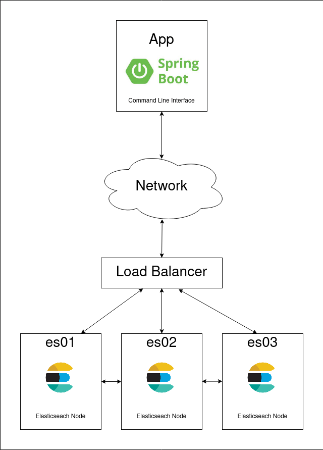

[](https://www.codacy.com/gh/LedioPapa/search-engine/dashboard?utm_source=github.com&amp;utm_medium=referral&amp;utm_content=LedioPapa/search-engine&amp;utm_campaign=Badge_Grade)
# Console Search engine with ElasticSearch
## Architecture
This is a simple search engine which can add documents to an index and query by their contents.



The architecture of the entire solution consists of 2 main parts:
- An Elasticsearch cluster of 3 nodes connected to a load balancer
- A Spring Boot command line application which resolves and validates commands and queries the cluster.

Docker Compose is used to configure the cluster.
It uses a shared network to make it possible for the nodes to communicate with the load-balancer 
and with each other for synchronization.
Components of the cluster are listed below:
- load-balancer:80 exposed on port 80 to the host machine
- es01:9200 exposed on port 9200 to the host machine
- es02:9201 exposed on port 9200 to the host machine
- es03:9202 exposed on port 9200 to the host machine
- search-engine_elastic network

The Spring Boot application is also dockerized and uses the same network as the cluster in order do be able to discover the nodes.
Below is mentioned the flow of the application:
- Initialize Beans and connection to the cluster
- Read input command through the application console
  - help command added to give more information on how to run the commands
- Input command is validated and resolved
- After resolving the appropriate service is called
- Available services are:
  - help  -> to print available commands or usages of each
  - index -> uses elasticsearch repository to add a document to the index
  - query -> uses elasticsearch repository to get the document ids which match the query expression
  - quit  -> close the application
- Print messages to the console using String Localization 

###Next steps  
This implementation was chosen in order to make way for future iterations of the solution with scalability in mind.
A future iteration to split the Spring Boot application into 2 main parts
- Web application which exposes different REST endpoints for the services mentioned above and handles the business logic
  - This way it would be possible to scale horizontally to handle bigger loads
  - It would also make possible to create different client applications (Commandline application, Front-end application etc)
- Different client applications which query the Web Application Endpoints 

## Requirements
JDK 8+

Apache Maven 3+

Docker

Docker Compose
## Running the Application
Navigate to the root folder of the project and run the following commands:
Start a cluster of three ElasticSearch nodes with Docker Compose
```
docker-compose up -d
```
Create the application image using Docker Build
```
docker build -t search-engine-app .
```
Start the application using Docker Run
```
docker run --rm -it --network search-engine_elastic search-engine-app
```
